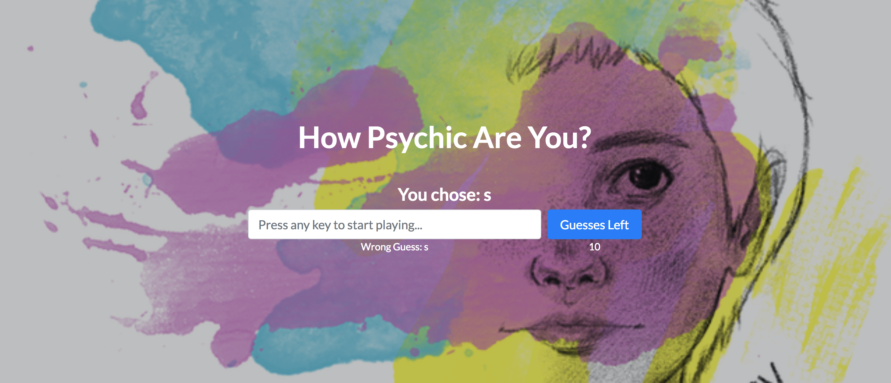
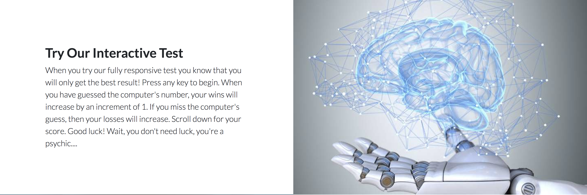

# Psychic Interactive Testing

### Overview
This app is a psychic test game. The user needs to guess what the computer is "guessing". 

## User Guide
Here's how it works:

- You have an initial form where you must type in a random letter and then hit the submit button. You have 10 guesses which count down under ```Guesses Left``` section. Your wrong guesses are also tracked. 




- When the user's guess matches the computer's guess then the winning section will increment by one. 


- When the user's runs out of guesses and none of them match the computer's guess then the losing section will increment by one. 


## Built Utilizing: 

* Bootstrap starter v4 - <https://stackpath.bootstrapcdn.com/bootstrap/4.1.3/css/bootstrap.min.css> \
* Material Design for Bootstrap 4 - <https://mdbootstrap.com/material-design-for-bootstrap/> \
* Javascript 
* Html5


